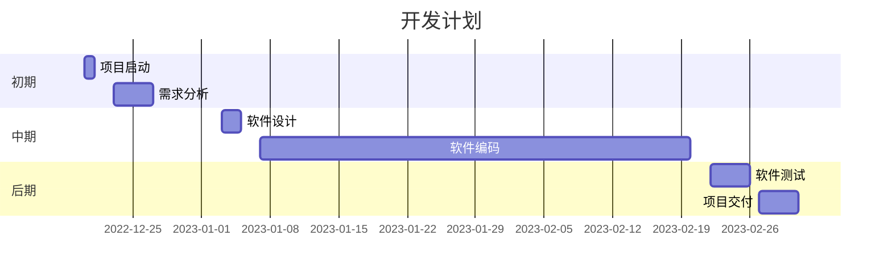

#旧物回收利用平台

组件库：[Ant Design Mobile](https://mobile.ant.design/zh "Ant Design Mobile")

***

###- 页面
    - 登录/注册
    - 首页
    - 利用
    - 我的

***

###- 模块：
    - 登录/注册
    - 物流信息（登录后可查看）
    - 利用
    - 用户信息（登录后显示信息）
    - 路由管理

***

### 登录注册——Author

请求后端数据方式：axios
状态管理：redux，浏览器安装redux插件Redux DevTools

数据持久化：将数据同时存储到本地存储

